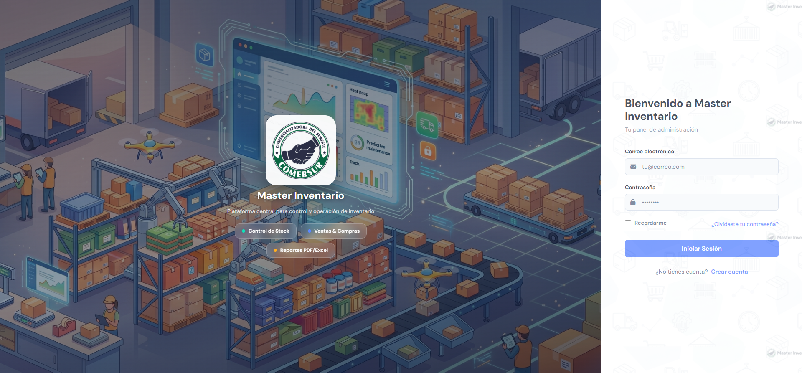
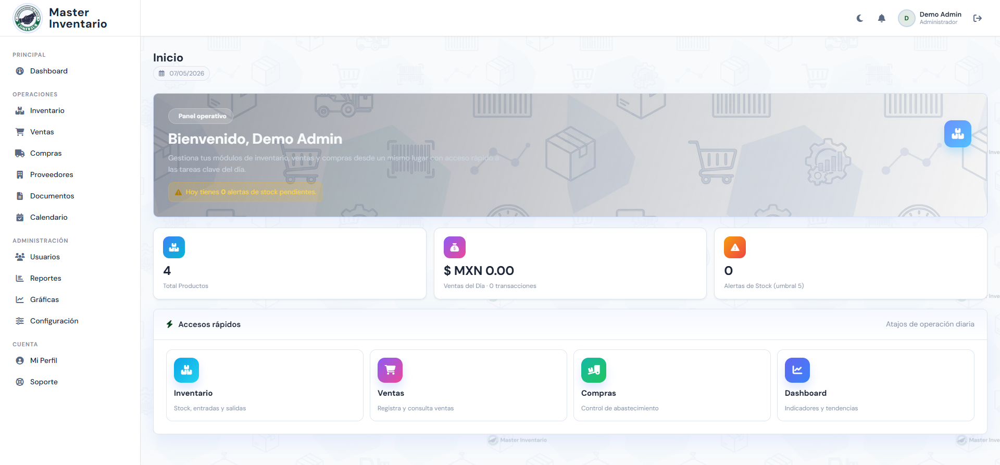
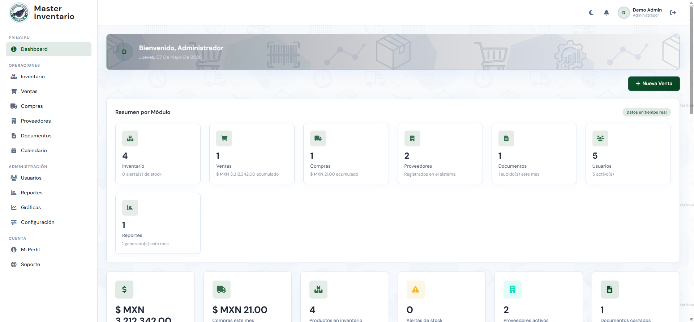
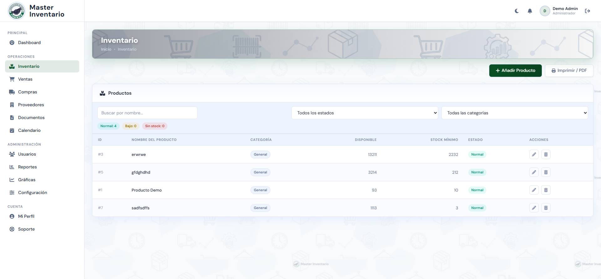
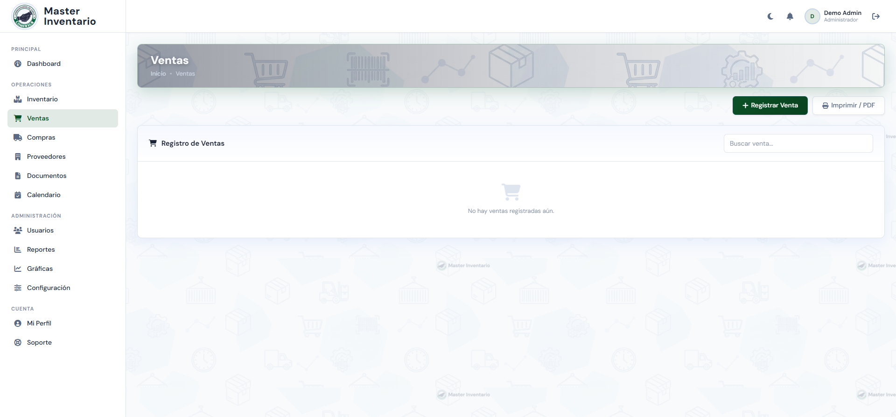
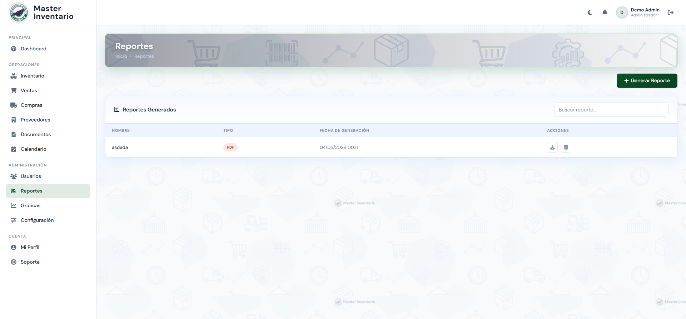

<div align="center">

# 📦 Master Inventario

**Sistema profesional de gestión de inventario, ventas y compras**

[](https://php.net)
[](https://mysql.com)
[](https://getbootstrap.com)
[](https://chartjs.org)
[](LICENSE)

</div>

---

## 📸 Capturas del sistema

<table>
  <tr>
    <td align="center"><strong>🔐 Inicio de sesión</strong></td>
    <td align="center"><strong>🏠 Panel principal</strong></td>
  </tr>
  <tr>
    <td></td>
    <td></td>
  </tr>
  <tr>
    <td align="center"><strong>📊 Dashboard analítico</strong></td>
    <td align="center"><strong>📦 Gestión de inventario</strong></td>
  </tr>
  <tr>
    <td></td>
    <td></td>
  </tr>
  <tr>
    <td align="center"><strong>🛒 Ventas</strong></td>
    <td align="center"><strong>📋 Reportes</strong></td>
  </tr>
  <tr>
    <td></td>
    <td></td>
  </tr>
</table>

---

## ✨ Características principales

| Módulo | Descripción |
|--------|-------------|
| 📦 **Inventario** | Control de stock en tiempo real con alertas de stock bajo y umbral configurable |
| 🛒 **Ventas** | Registro de transacciones, detalle de venta y generación de facturas en PDF |
| 🚚 **Compras** | Órdenes de compra, gestión de proveedores y control de abastecimiento |
| 👥 **Usuarios** | Roles jerárquicos (Administrador / Empleado / Usuario), 2FA y rate limiting |
| 📊 **Dashboard** | KPIs en tiempo real, gráficas interactivas con Chart.js y tendencias |
| 📋 **Reportes** | Exportación a PDF y Excel, reportes históricos y plantillas personalizadas |
| 📄 **Documentos** | Gestión documental con historial de versiones |
| 🗓️ **Agenda** | Calendario de eventos y tareas de mantenimiento |
| ⚙️ **Configuración** | Tema, moneda, logo, banner y parámetros del sistema completamente personalizables |
| 🔒 **Seguridad** | Protección contra SQL injection, CSRF, rate limiting por IP y cuenta, reCAPTCHA v3 |

---

## 🛡️ Seguridad implementada

- ✅ **Prepared statements** en todas las consultas SQL (MySQLi)
- ✅ **Rate limiting** por IP (20 fallos / 15 min) y por cuenta (escalado: 15 / 30 / 60 min)
- ✅ **Autenticación de dos factores** (2FA) con código por correo
- ✅ **Recuperación de contraseña** con token de un solo uso
- ✅ **Google reCAPTCHA v3** en formularios de acceso
- ✅ **Registro de intentos de inyección SQL** en tabla de auditoría
- ✅ **Auditoría completa**: 11 tablas de historial + triggers automáticos en BD
- ✅ **Roles y permisos** granulares por módulo

---

## 🧱 Stack tecnológico

### Backend
| Tecnología | Uso |
|------------|-----|
| **PHP 8.3** | Lógica de negocio (procedural modular) |
| **MySQL 8.0** | Base de datos relacional con triggers |
| **PHPMailer** | Envío de correos (SMTP / Gmail) |
| **PhpSpreadsheet** | Exportación a Excel (.xlsx) |
| **FPDF** | Generación de reportes PDF |

### Frontend
| Tecnología | Uso |
|------------|-----|
| **Bootstrap 5.3** | Grid, componentes UI responsivos |
| **Chart.js** | Gráficas de barras, líneas y dona |
| **Font Awesome 6** | Iconografía (1,500+ iconos) |
| **DM Sans / Inter** | Tipografía profesional (Google Fonts) |
| **CSS Custom Properties** | Theming dinámico, modo oscuro, glassmorphism |

---

## 🗄️ Base de datos

El sistema utiliza **28 tablas** organizadas en los siguientes dominios:

```
📁 Usuarios & Auth        → Usuarios, LoginAttempts, configuracion_interfaz
📁 Inventario             → Inventario, Entradas_Inventario, Salidas_Inventario
📁 Ventas                 → Ventas, Detalle_Ventas
📁 Compras                → Compras, Detalle_Compras, Proveedores
📁 Documentos             → Documentos, Documentos_Registros, Reportes
📁 Sistema                → configuracion_sistema_global, incidentes_soporte
📁 Auditoría (11 tablas)  → Historial_* (triggers automáticos en todas las entidades)
```

---

## 🚀 Instalación rápida

### Requisitos previos
- PHP >= 8.0
- MySQL >= 8.0 o MariaDB >= 10.6
- Composer
- Servidor web (Apache / Nginx) o XAMPP

### Pasos

```bash
# 1. Clona el repositorio
git clone https://github.com/Niicko12/Master-Inventario.git
cd Master-Inventario

# 2. Instala dependencias PHP
composer install

# 3. Copia y configura las variables de entorno
cp .env.example .env
# Edita .env con tus credenciales de BD y SMTP

# 4. Importa el esquema de base de datos
mysql -u root -p < bd.sql

# 5. Inicia el servidor (desarrollo)
php -S localhost:8000

# 6. Abre en tu navegador
# http://localhost:8000
```

> **XAMPP:** Copia la carpeta en `C:/xampp/htdocs/Inventario` y accede desde `http://localhost/Inventario`

---

## 📁 Estructura del proyecto

```
Master-Inventario/
├── 📂 assets/              # Recursos estáticos
│   └── images/             # Logos, banners, SVG íconos, productos
├── 📂 docs/                # Documentación y capturas
│   └── screenshots/        # Capturas del sistema
├── 📂 functions/           # Funciones auxiliares (auth, rate limiting)
├── 📂 includes/            # Componentes reutilizables (auth_check, acciones)
├── 📂 layout/              # Plantillas de layout (sidebar, footer)
├── 📂 styles/              # CSS personalizado (components, template-theme)
├── 📂 utils/               # Utilidades (BD, paginación, configuración)
├── 📂 vendor/              # Dependencias PHP (composer)
├── ⚙️  config.php          # Bootstrap principal (carga .env, BD, utils)
├── 🗄️  bd.sql              # Esquema completo de base de datos
├── 🏠  index.php           # Panel de inicio
├── 📊  dashboard.php       # Dashboard analítico
├── 🔐  login.php           # Autenticación
├── 📦  gestion_inventario.php
├── 🛒  gestion_ventas.php
├── 🚚  gestion_compras.php
├── 👥  administrar_usuarios.php
├── 📋  reportes.php
└── ⚙️  configuracion_sistema.php
```

---

## ⚙️ Configuración

Todas las opciones del sistema se gestionan desde **Configuración → Sistema**:

| Parámetro | Descripción |
|-----------|-------------|
| `nombre_instancia` | Nombre que aparece en la UI y correos |
| `moneda_codigo` | Moneda del sistema (MXN, USD, EUR) |
| `umbral_stock_bajo` | Número mínimo de unidades antes de alertar |
| `banner_imagen` | Imagen de fondo de los módulos |
| `banner_overlay_color` | Color del overlay del banner |
| `modo_oscuro_permanente` | Activar modo oscuro por defecto |
| `logo_path` | Logo de la instancia |
| `logs_actividad` | Habilitar / deshabilitar auditoría |

---

## 👤 Roles de usuario

| Rol | Acceso |
|-----|--------|
| **Administrador** | Acceso total: usuarios, configuración, reportes, todos los módulos |
| **Empleado** | Inventario, ventas, compras, proveedores, agenda |
| **Usuario** | Solo lectura en módulos asignados |

---

## 🤝 Contribuir

Las contribuciones son bienvenidas.

```bash
# 1. Fork del repositorio
# 2. Crea tu rama de feature
git checkout -b feature/nueva-funcionalidad

# 3. Commit con mensaje descriptivo
git commit -m "feat: agrega exportación de inventario a CSV"

# 4. Push y abre un Pull Request
git push origin feature/nueva-funcionalidad
```

---

## 📄 Licencia

Distribuido bajo la licencia **MIT**. Ver [`LICENSE`](LICENSE) para más información.

---

<div align="center">

Hecho con ❤️ por [Limber Magaña](https://github.com/Niicko12)

⭐ **Si este proyecto te es útil, dale una estrella en GitHub**

</div>
